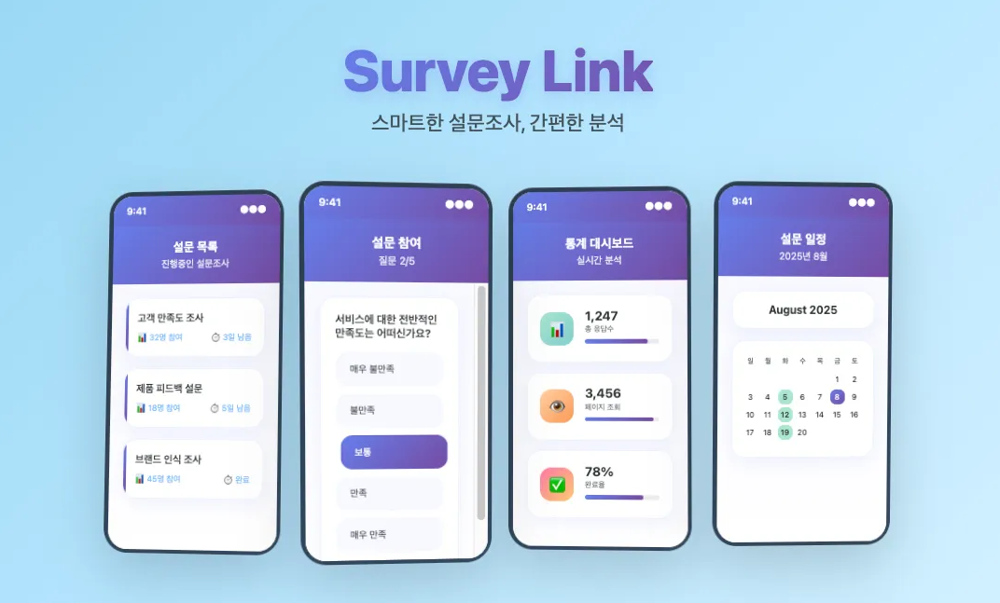
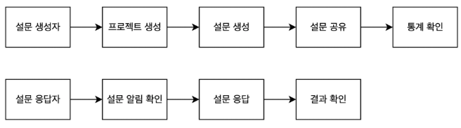
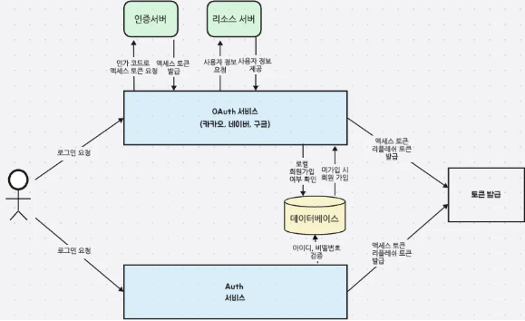
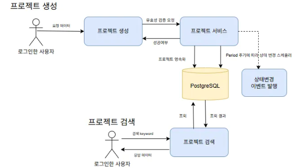
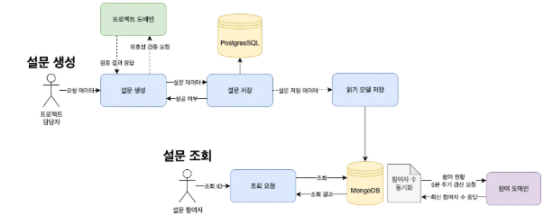
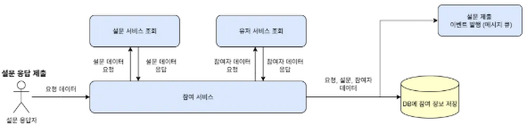
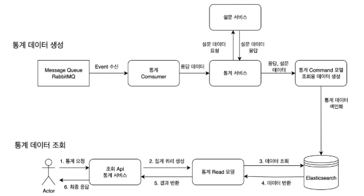
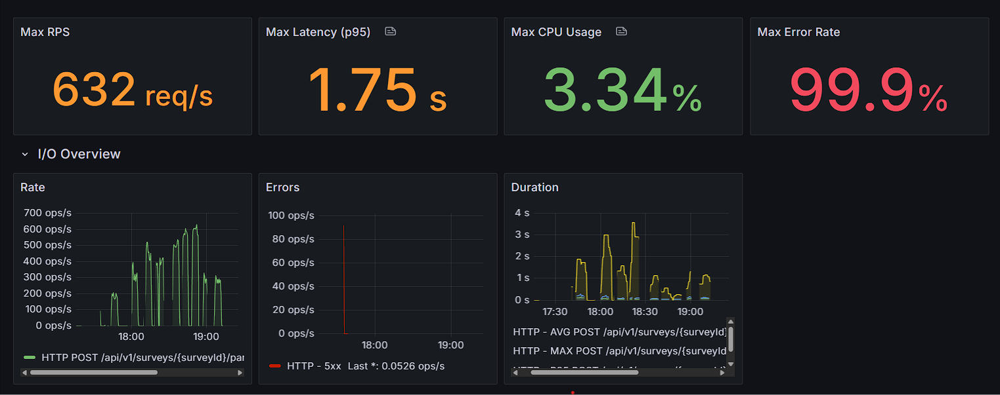
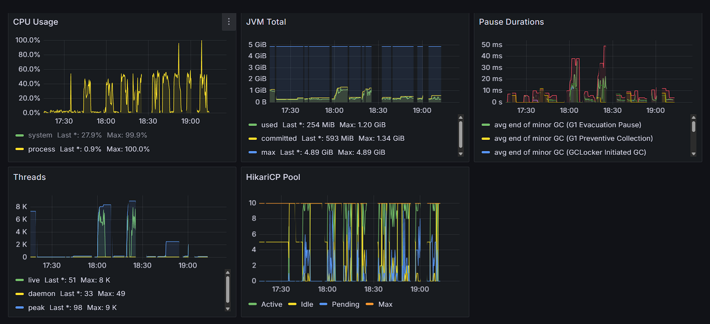
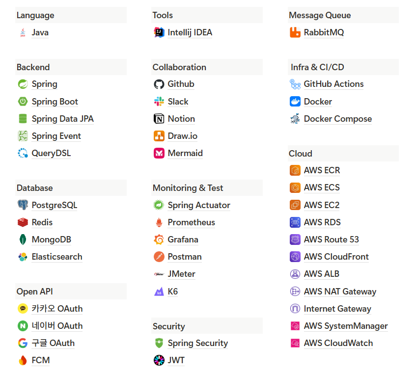

# Survey Link

---

## 목차

- [1. 프로젝트 소개](#1-프로젝트-소개)
    - [1.1. 개발 배경](#11-개발-배경)
    - [1.2. 핵심 기능](#12-핵심-기능)
    - [1.3. 사용자 경험](#13-사용자-경험)
- [2. 팀원 소개](#2-팀원-소개)
- [3. 협업 문화](#3-협업-문화)
    - [3.1. 이슈 및 PR 기반 워크플로우](#31-이슈-및-pr-기반-워크플로우)
    - [3.2. 정기 스크럼](#32-정기-스크럼)
- [4. 핵심 서비스 플로우](#4-핵심-서비스-플로우)
- [5. 도메인별 주요 기능](#5-도메인별-주요-기능)
    - [5.1. 사용자 시스템](#51-사용자-시스템)
    - [5.2. 프로젝트 시스템](#52-프로젝트-시스템)
    - [5.3. 설문 시스템](#53-설문-시스템)
    - [5.4. 공유 시스템](#54-공유-시스템)
    - [5.5. 참여 시스템](#55-참여-시스템)
    - [5.6. 통계 시스템](#56-통계-시스템)
- [6. 모니터링](#6-모니터링)
- [7. 기술 스택](#7-기술-스택)
- [8. 기술적 의사결정](#8-기술적-의사결정)
- [9. 성능 최적화](#9-성능-최적화)
- [10. 트러블 슈팅](#10-트러블-슈팅)

---

## 1. 프로젝트 소개

### 1.1. 개발 배경

기존의 구글 폼, 네이버 폼과 같은 설문 도구들은 편리하지만 다음과 같은 한계를 가지고 있습니다.

- **참여자:** 이름, 이메일 등 개인정보를 매번 입력해야 하는 번거로움이 존재합니다.
- **설문 생성자:** 설문 결과를 실시간으로 분석하기 어렵고, 데이터를 수동으로 가공해야 합니다.

이러한 문제의식에서 출발하여, **"설문 생성자와 참여자 모두가 더 쉽고 즐겁게 설문을 경험할 방법은 없을까?"** 라는 질문에 대한 해답으로 **Survey Link**를 개발하게 되었습니다.

### 1.2. 핵심 기능

**Survey Link**는 **설문 참여를 게임처럼 즐길 수 있는 웹 기반 설문 플랫폼**입니다.

- **게이미피케이션:** 설문 참여, 종료 등 활동마다 포인트를 지급하고 등급을 부여하여 사용자의 성취감을 높입니다.
- **타겟팅 설문:** 등록된 사용자 프로필(연령, 성별, 지역 등)을 기반으로 원하는 대상에게 정교한 설문 배포가 가능합니다.
- **실시간 데이터 분석:** 수집된 데이터는 통계에 즉시 반영되어 실시간 분석과 신속한 의사결정을 지원합니다.

### 1.3. 사용자 경험

Survey Link는 단순한 설문 도구를 넘어, **참여자에게는 성장과 성취의 경험을, 설문 발행자에게는 효율적인 데이터 수집 및 분석 환경**을 제공하는 것을 목표로 합니다.

**더 쉽고, 더 빠르고, 더 즐겁게.** Survey Link는 설문의 새로운 패러다임을 제시합니다.

---

## 2. 팀원 소개

| 이름      | 역할  | 담당                                   | GitHub                                  |
|:--------|:----|:-------------------------------------|:----------------------------------------|
| **유진원** | 팀장  | 통계 도메인, 아키텍처 설계, 클라우드 인프라 구축         | [GitHub](https://github.com/Jindnjs)    |
| **이동근** | 팀원  | 유저 도메인, Spring Security + JWT, OAuth | [GitHub](https://github.com/DG0702)     |
| **장경혁** | 팀원  | 참여 도메인                               | [GitHub](https://github.com/kcc5107)    |
| **이준영** | 부팀장 | 설문 도메인, 인프라 구축                       | [GitHub](https://github.com/LJY981008)  |
| **최태웅** | 팀원  | 프로젝트 도메인                             | [GitHub](https://github.com/taeung515)  |
| **김도연** | 팀원  | 공유 도메인                               | [GitHub](https://github.com/easter1201) |

---

## 3. 협업 문화

### 3.1. 이슈 및 PR 기반 워크플로우

- **자동화된 브랜치 및 PR 생성:** 이슈를 생성하면 해당 이슈 제목으로 원격 브랜치와 PR이 자동으로 생성되어, 개발자가 즉시 작업에 착수할 수 있습니다.
- **코드 리뷰 의무화:** 모든 PR은 팀원 2명 이상의 승인을 받아야만 병합(merge)할 수 있도록 하여 코드 품질을 유지하고 동료 검증을 강화합니다.
- **자동화된 브랜치 및 이슈 관리:** PR이 병합되면 관련 브랜치는 자동으로 삭제되고 이슈는 종료(close) 처리됩니다. 이를 통해 저장소를 깔끔하게 유지하고 팀원들이 프로젝트 진행 상황을 쉽게 파악할 수
  있습니다.
- **실시간 리뷰 알림:** 코드 리뷰를 요청하면 팀 슬랙(Slack) 채널에 알림이 전송되며, 리뷰 댓글이나 PR 수정 시에도 추가 알림이 발생하여 원활한 피드백 사이클을 지원합니다.

### 3.2. 정기 스크럼

매일 세 차례 정기 스크럼을 통해 팀의 진행 상황을 공유하고 이슈를 해결합니다.

- **아침 (계획 공유):** 당일 작업 계획을 공유합니다.
- **점심 (중간 점검):** 진행 상황을 점검하고 발생한 문제를 논의합니다.
- **저녁 (회고 및 마무리):** 일일 작업 성과를 회고하고 다음 단계를 논의합니다.

이러한 정기적인 소통을 통해 팀은 공동의 목표를 명확히 인지하고, 신속한 피드백을 바탕으로 효율적인 협업을 지속할 수 있었습니다.

---

## 4. 핵심 서비스 플로우

---

## 5. 도메인별 주요 기능

5.1. 사용자 시스템

#### ✨ 로그인 플로우

- **기능:** 사용자가 서비스에 접근하기 위한 인증 절차를 담당합니다.
- **특징:** 자체 회원가입 및 로그인(Local)과 OAuth 2.0(카카오, 네이버, 구글)을 이용한 소셜 로그인을 모두 지원합니다.

5.2. 프로젝트 시스템

#### ✨ 프로젝트 생성 및 검색 플로우

- **프로젝트 생성·관리**: 신규 프로젝트를 생성하며, 설정된 기간(Period)에 따라 상태가 자동으로 변경되도록 스케줄링합니다.

- **프로젝트 검색**: Trigram 인덱스를 활용하여 부분 검색과 오타 검색을 지원하며, No-Offset 페이지네이션을 적용하여 대용량 데이터 조회 성능을 개선했습니다.

- **도메인 이벤트 기반 처리**: 매니저/멤버 추가, 상태 변경, 삭제 등 주요 동작 시 도메인 이벤트를 발행하며, 이벤트 리스너에서 메시지 브로커(RabbitMQ 등)로 전달하여 타 도메인과 연계되도록 처리했습니다.

- **동시 참여 제한 및 낙관적 락**: Project 엔티티에 @Version 필드를 적용하여 동시 업데이트 충돌을 방지하며, 최대 인원 수(maxMembers) 제한 및 중복 가입 검증을 수행했습니다. 또한 (project_id, user_id) 유니크 제약 조건을 통해 중복 참여를 차단했습니다.

5.3. 설문 시스템

#### ✨ 설문 생성 및 조회 플로우

- **설문 생성:** 프로젝트 담당자 또는 권한을 가진 사용자가 설문을 생성합니다. 생성 시 읽기 모델(Read Model)을 동기화하고, 지연 이벤트(Delayed Event)를 통해 설문 시작 및 종료를
  제어합니다.
- **설문 조회:** 읽기 모델을 사용하여 조회 성능을 최적화했으며, 스케줄링을 통해 참여자 수를 주기적으로 갱신합니다.

5.4. 공유 시스템

- (내용 추가 필요)

5.5. 참여 시스템

#### ✨ 설문 응답 제출 플로우

- **기능:** 사용자가 특정 설문에 대한 답변을 제출하는 핵심 기능입니다.
- **동작:** 설문 응답이 저장되면, 관련 처리를 위해 `ParticipationCreated` 이벤트를 발행(publish)합니다.

5.6. 통계 시스템

#### ✨ 통계 집계 및 조회 플로우

- **통계 집계:** 이벤트 기반으로 통계 데이터를 수신하여 Elasticsearch에 색인합니다.
- **통계 조회:** Elasticsearch의 Aggregation 기능을 활용하여 집계된 데이터를 효율적으로 조회하고 반환합니다.

---

## 6. 모니터링

- Spring Boot Actuator를 통해 애플리케이션의 상태와 메트릭을 외부에 노출하고, Prometheus가 이를 주기적으로 수집합니다.
- 수집된 데이터는 Grafana 대시보드에서 시각화하여 요청 지연, 에러율, 리소스 사용량(JVM, CPU, 스레드, DB 커넥션 풀 등)을 실시간으로 모니터링합니다.

---

## 7. 기술 스택

- **[기술 선택 근거 확인하기](https://www.notion.so/teamsparta/2322dc3ef51480f8b74ff6455fca4917)**

---

## 8. 기술적 의사결정

- [스케줄링 방식 vs 개별 처리 방식 의사 결정](https://www.notion.so/teamsparta/vs-2542dc3ef51480d18141d940af62388e)
- [조회 모델을 위한 기술적 의사 결정: MongoDB 채택](https://www.notion.so/teamsparta/MongoDB-2542dc3ef514802389aff6fb59470acb)
- [외부 API 호출로 인한 스레드 병목 현상 개선](https://www.notion.so/teamsparta/API-2542dc3ef5148037ac82e307365c1f72)
- [배포 환경 결정: EC2 vs ECS](https://www.notion.so/teamsparta/EC2-vs-ECS-2542dc3ef51480b18997ca8eeb090a88)
- [전략 패턴(Strategy Pattern) 도입](https://www.notion.so/teamsparta/EC2-vs-ECS-2542dc3ef51480b18997ca8eeb090a88)
- [웹 PUSH 알림: 웹 소켓(WebSocket) 도입 검토](https://www.notion.so/teamsparta/2552dc3ef51480b4abfac5763b3ffe05)

---

## 9. 성능 최적화

- [설문 응답 제출 성능 최적화 (Redis 활용)](https://www.notion.so/teamsparta/Redis-2542dc3ef514809bbd55c5fae2e1e08a)
- [프로젝트 검색 API 성능 검증 및 No-Offset 페이지네이션 도입](https://www.notion.so/teamsparta/API-NoOffset-2542dc3ef51480afaf75f539d821afe4)
- [테이블 비정규화를 통한 설문 제출 성능 개선](https.notion.so/teamsparta/2542dc3ef51480609d96d9cd20ab9d8c)
- [회원 탈퇴 로직의 구조적 문제 개선](https://www.notion.so/teamsparta/2542dc3ef51480dca912c246719869bf)
- [PostgreSQL의 GIN 인덱스를 활용한 검색 성능 향상](https://www.notion.so/teamsparta/PostgreSQL-GIN-Index-2542dc3ef5148058b9bfef04a4864633)

---

## 10. 트러블 슈팅

- [스케줄링 시 데이터가 누락되는 문제 해결](https://www.notion.so/teamsparta/2542dc3ef51480dea65dcc813544ca12)
- [공유 도메인 구조 변경 및 개선](https://www.notion.so/teamsparta/2552dc3ef51480a997dbd8965800621e)

---

## 11. 시연 영상

